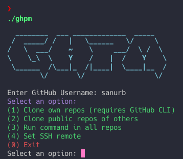

<div align = "center">

<h1><a href="https://sanurb.github.io/ghpm">ghpm</a></h1>

<a href="https://github.com/sanurb/ghpm/blob/main/LICENSE">
 </a>

<a href="https://github.com/sanurb/ghpm/graphs/contributors">
 </a>

<a href="https://github.com/sanurb/ghpm/stargazers">
</a>

<a href="https://github.com/sanurb/ghpm/network/members">
 </a>

<a href="https://github.com/sanurb/ghpm/watchers">
 </a>

<a href="https://github.com/sanurb/ghpm/pulse">
 </a>

<h3>A GitHub Project Manager 🧑‍💻⚙️</h3>

<figure>
  
  <br/>
  <figcaption>ghpm screenshot</figcaption>
</figure>

</div>

## 📜 What is ghpm?

ghpm is a powerful utility that lets you orchestrate batch operations across all your GitHub projects:

- Clone all your repositories or any other user's repos in one go.
- Use it to push, pull, and conduct any other operation on all your projects simultaneously.

## 🌈 Inspiration

I have a lot of repos on my GitHub and maintaining them was becoming a pain, also this makes moving my work to a new machine really smooth.

## ⚙️ Requirements

Before you begin, ensure you have met the following requirements:

- You have a working Go environment.
- Cloning self repos requires authentication and uses the GitHub CLI (`gh`).

## Install

To install ghpm, follow these steps:

```bash
go install github.com/sanurb/ghpm@latest
```

## Using ghpm


```bash
ghpm
```

This will open up the self guided menu with a list of operations you can perform.

> You can use option 3 to run any command in all your GitHub repos, very useful for push, pull and similar commands.

## How it was built

ghpm was built using `Go`

## Challenges faced

Figuring out the GitHub api and authentication was a challenge, I used `gh` to do some heavy lifting.

## 🎓 What I learned
- Go best practices for command-line tools.
- Utilizing Go modules for clean, efficient dependency management.
- Leveraging interfaces and concurrency for scalable script design.

Hit the ⭐ button if you found this useful.

## More Info

<div align="center">

<a href="https://github.com/sanurb/ghpm">Source</a> | <a href="https://sanurb.github.io/ghpm">Website</a>

</div>